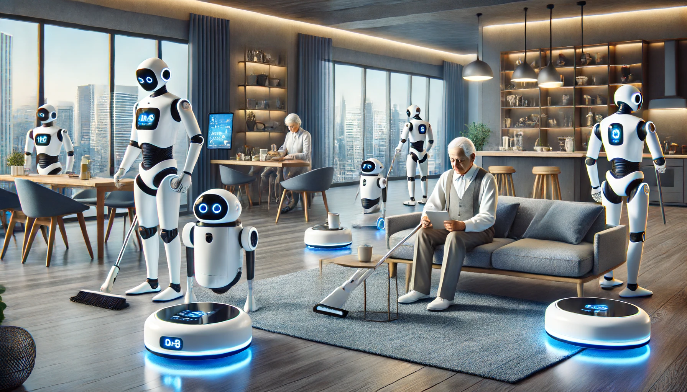

---
# Feel free to add content and custom Front Matter to this file.
# To modify the layout, see https://jekyllrb.com/docs/themes/#overriding-theme-defaults

permalink: /
title: "ICRA Workshop 2025: Multi-Agent Embodied Intelligent Systems Meet Foundation Models and Large-scale Datasets: Challenges and Future"
list_title: Home
topic: "Multi-Agent Embodied Intelligent Systems Meet Foundation Models and Large-scale Datasets: Challenges and Future"
layout: home
---

<a href="https://2025.ieee-icra.org/">2025 IEEE International Conference on Robotics & Automation, USA</a>

May 19th, 2025

<!-- 
Location: Sequoia 1
 -->
<!-- 
[<a href="">Youtube</a>] [<a href="https://discord.gg/yqjTtBmUJC">Discord</a>] [<a href="https://openreview.net/group?id=IEEE.org/2024/ICRA/Workshop/WIHR">OpenReview</a>]
 -->
<!-- 
Recording available at: <a href="">Youtube</a>
 -->

This workshop aims to explore the innovative integration of "**Multi-Agent Embodied Intelligent Systems Meet Foundation Models and Large-scale Datasets: Challenges and Futur**".

This workshop focuses on the intersection of multi-agent embodied intelligent systems, foundation models, and large-scale datasets, tackling the core challenges and future research directions in this domain. Embodied intelligent systems, which are agents capable of learning and making decisions through interactions with their physical environment, are crucial for advancing autonomy in robotics and AI. The integration of foundation models into these systems offers the potential to significantly enhance their ability to generalize across tasks, environments, and agents. However, this raises key challenges, particularly in the context of multi-agent systems where collaborative behaviors and real-world adaptability are essential. A major focus of the workshop will be the development of large-scale datasets tailored for embodied intelligence, as current datasets often lack the richness needed for robust training in complex environments. The workshop will explore how to leverage foundation models and large-scale data to improve the decision-making, adaptability, and scalability of embodied multi-agent systems. Through case studies, technical presentations, and discussions, the workshop aims to address current limitations and set the stage for future advancements in the field.

The workshop will delve into the following pivotal research questions:
* Foundation Models for Embodied Intelligence: How can foundation models, traditionally trained on static or disembodied data, be adapted for embodied intelligent systems, where physical interaction with the environment is critical for learning and decision-making?
* Challenges in Multi-Agent Embodied Systems: What are the unique challenges in coordinating multiple embodied intelligent agents, and how can large-scale datasets and foundation models support better collaboration, communication, and adaptability in multi-agent environments?
* Large-Scale Dataset Creation and Utilization: What methods can be employed to create and curate large-scale datasets that capture the complexity and variability required for embodied intelligent systems, ensuring robustness in real-world applications?
* Scalability of Embodied Multi-Agent Systems: What strategies can be implemented to scale embodied intelligent systems and foundation models across diverse tasks and environments, while ensuring performance, safety, and generalization in real-world applications?

<!-- This workshop aims to explore the innovative integration of data-driven flywheel mechanisms in robotic policy learning and will primarily discuss "**Data-Driven Policy Learning Meets Scaling Law: Robot's New Era?**". As robotics systems increasingly perform complex, autonomous tasks, the ability to iteratively improve based on continuous data feedback becomes crucial. Key questions include:

* How can data flywheels be effectively implemented in autonomous robotic systems?
* What are the main challenges in integrating continuous learning mechanisms?
* How can data-driven strategies be scaled across different robotic applications? -->

This workshop will benefit the robot learning community by highlighting cutting-edge methodologies, fostering interdisciplinary discussions, and setting the stage for future collaborative research.

    

**Keywords specific to the event**

Multi-Agent, Embodied Intelligent, Foundation Models, Policy Generalization, Continuous Learning, Robotic Policy Learning, Data Flywheel, Policy Generalization, Continuous Learning

&nbsp;
&nbsp;

## Call for Papers
&nbsp;

### Submission Topics

**Foundation Models in Robotics:**
- Exploring the adaptation and implementation of foundation models to enhance robotic perception, control, and autonomy.

**Data Generation and Collection for Robotic Learning:**
- Discussing methods for automatic data generation and large-scale data collection strategies that support advanced learning algorithms in robotics.

**Reinforcement and Imitation Learning for Physical Robot Control:**
- Detailing the use of reinforcement and imitation learning strategies for effective physical control of robots, highlighting successes, challenges, and lessons learned.

**Data Flywheel Mechanisms in Robotics:**
- Case Studies: Demonstrating the impact of data flywheels on autonomous robotic systems.
- Novel Architectures: Proposing new architectures for data accumulation and utilization in robotic learning.

**Continuous Learning in Robotics:**
- Techniques and Algorithms: Papers detailing innovative algorithms and techniques for continuous learning in robots.
- Challenges and Solutions: Discussing the main challenges in long-term deployment and solutions to maintain stability and performance.

**Scalability of Data-Driven Approaches:**
- Cross-Environment Studies: Examining the scalability of data-driven robotic systems across diverse environments.
- Comparative Analyses: Comparing data-driven strategies in different scales of robotic applications, from small to large-scale systems.

**Future Directions in Robotic Policy Learning:**
- Visionary Predictions: Papers predicting future trends and identifying upcoming challenges in data-driven robotic policy learning.
- Innovative Frameworks: Proposing new frameworks or models that could drive the next generation of robotic systems.

&nbsp;

### Important Dates

1. **Paper Submission Deadline:** January 28th, 2025

2. **Notification of Acceptance:** February 25th, 2025

3. **Camera-Ready Submission Deadline:** March 9th, 2025

&nbsp;

### Important Notes

Please submit your full papers according to the following guidelines:
- **Format:** All papers must be formatted according to ICRA template.
- **Length:** Full papers should be a maximum of 6 pages.
- **Submission Portal:** Submit your papers through Openreview System.

&nbsp;

###  Contact

If you have any questions, please contact us at: leningwang@buaa.edu.cn.

&nbsp;
&nbsp;
## Invited Speakers/Panelists
&nbsp;

    

        <figure>
        
        <figcaption><b><a href="https://people.eecs.berkeley.edu/~svlevine/index.htm">Sergey Levine</a></b> The University of California Berkeley</figcaption>
        </figure>
    

    

        <figure>
        
        <figcaption><b><a href="https://www.ce.cit.tum.de/en/air/people/prof-dr-ing-habil-alois-knoll/">Alois Knoll</a></b> Technical University of Munich</figcaption>
        </figure>
    

     

        <figure>
        
        <figcaption><b><a href="https://haosu-robotics.github.io/">Hao Su</a></b> North Carolina State University, USA</figcaption>
        </figure>
    

     

        <figure>
        
        <figcaption><b><a href="https://mobility-lab.seas.ucla.edu/about/">Jiaqi Ma</a></b> University of California Los Angeles, USA</figcaption>
        </figure>
    

    

        <figure>
        
        <figcaption><b><a href="https://www.hci.uni-tuebingen.de/chair/team/shahram-eivazi">Shahram Eivazi</a></b> University of Tübingen</figcaption>
        </figure>
    

    

        <figure>
        
        <figcaption><b><a href="http://web.stanford.edu/~schwager/">Mac Schwager</a></b> Stanford University</figcaption>
        </figure>
    

    
   
    

        <figure>
         
        <figcaption><b><a href="https://linsats.github.io/">Lin Shao</a></b> National University of Singapore, Singapore</figcaption>
        </figure>
    

    

        <figure>
        
        <figcaption><b><a href="https://research.google/people/tingnanzhang/?&type=google">Tingnan Zhang</a></b> Google DeepMind</figcaption>
        </figure>
    

    

        <figure>
        
        <figcaption><b><a href="http://ghli.org/">Guohao Li
</a></b> Camel-AI</figcaption>
        </figure>
    

    

        <figure>
        
        <figcaption><b><a href="https://qq456cvb.github.io/">Yang You</a></b> Stanford University, USA</figcaption>
        </figure>
    

    

        <figure>
        
        <figcaption><b><a href="https://lihongyang.info/">Hongyang Li</a></b> University of Hong Kong, China</figcaption>
        </figure>
    

    

&nbsp;

## Organizers
&nbsp;

    

        <figure>
        
        <figcaption><b><a href="https://www.csc.kth.se/~danik/">Danica Kragic</a></b> Royal Institute of Technology (KTH)</figcaption>
        </figure>
    

    

        <figure>
        
        <figcaption><b><a href="https://www.shanghangzhang.com/">Shanghang Zhang</a></b> Peking University </figcaption>
        </figure>
    

    

        <figure>
        
        <figcaption><b><a href="http://luoping.me/">Ping Luo</a></b> The University of Hong Kong</figcaption>
        </figure>
    

    

        <figure>
        
        <figcaption><b><a href="https://fanshi14.github.io/me/">Fan Shi</a></b> National University of Singapore</figcaption>
        </figure>
    

        

        <figure>
        
        <figcaption><b><a href="https://hucaofighting.github.io/">Hu Cao</a></b> Technical University of Munich</figcaption>
        </figure>
    

    

        <figure>
        
        <figcaption><b><a href="https://dingmyu.github.io/">Mingyu Ding</a></b> The University of North Carolina at Chapel Hill</figcaption>
        </figure>
    

        

        <figure>
        
        <figcaption><b><a href="https://wzzheng.net/">Wenzhao Zheng</a></b> The University of California Berkeley</figcaption>
        </figure>
    

        

        <figure>
        
        <figcaption><b><a href="https://zipengfu.github.io/">Zipeng Fu</a></b> Stanford University</figcaption>
        </figure>
    

        

        <figure>
        
        <figcaption><b><a href="http://web.stanford.edu/~jksun/">Jiankai Sun</a></b> Stanford University</figcaption>
        </figure>
    

        

        <figure>
        
        <figcaption><b><a href="https://yufeiwang63.github.io/">Yufei Wang</a></b> Carnegie Mellon University</figcaption>
        </figure>
    

    

        <figure>
        
        <figcaption><b><a href="https://yaomarkmu.github.io/">Yao Mu</a></b> Then University of Hong Kong</figcaption>
        </figure>
    

        

        <figure>
        
        <figcaption><b><a href="https://scholar.google.com/citations?user=obCtm2UAAAAJ&hl=en&oi=ao">Lening Wang</a></b> Peking University</figcaption>
        </figure>
    

    

        <figure>
        
        <figcaption><b><a href="https://scholar.google.com/citations?user=JW4F5HoAAAAJ&hl=en&oi=ao">Haibao Yu</a></b> Then University of Hong Kong</figcaption>
        </figure>
    

    

<!-- 
## Program Committee
&nbsp;

    

        

&#8226;&nbsp;<a href="">Jiaru Zhong</a> (BIT)

        

&#8226;&nbsp;<a href="">Zhenwei Yang</a> (USTB)

        

&#8226;&nbsp;<a href="https://sites.google.com/site/yangliuveronica/">Yang Liu</a> (Tsinghua University)

        

&#8226;&nbsp;<a href="https://xieenze.github.io/">Enze Xie</a> (HKU)

        

&#8226;&nbsp;<a href="https://scholar.google.com/citations?user=KlHuj2QAAAAJ&hl">Yifeng Shi</a> (Baidu)

        

&#8226;&nbsp;<a href="https://scholar.google.com/citations?user=1H5PwZkAAAAJ&hl">Weitao Zhou</a> (Tsinghua University)

        

&#8226;&nbsp;<a href="https://phyllish.github.io/">Yue Hu</a> (SJTU)

    

 -->

### Proposed format and Schedule
&nbsp;

| Time          | Event             |
|---------------|-------------------|
| 09:00-10:30   | Invited Talks Session 1 |
| 10:45-12:15   | Panel Discussion   |
| 13:30-15:00   | Invited Talks Session 2 |
| 15:15-16:45   | Poster Sessions     |
| 17:00-18:30   | Demonstrations and Closing Remarks |

<!-- 

###  Plans to Encourage Participation
&nbsp;

To enhance diversity and inclusivity at our workshop, we propose the following strategies:
#### 1. Outreach Initiatives
We will partner with organizations representing underrepresented groups in robotics and AI, such as Women in Robotics and Embodied AI. Our approach includes personalized invitations and collaborative efforts with university diversity offices, particularly those serving minority institutions.

#### 2. Mentoring Opportunities

Prior to the workshop, we will organize virtual mentoring sessions where established researchers can offer career guidance, research advice, and networking tips to participants from diverse backgrounds. A 'Meet the Speakers' session will provide attendees with direct access to our panelists and invited speakers, facilitating mentorship and collaboration.

#### 3. Accessibility Measures

All sessions will be recorded and accessible post-workshop to accommodate various time zones and participants unable to attend in person.

#### 4. Promotional Activities
We will employ a combination of traditional and digital marketing strategies to reach a global audience. Our promotion will extend through academic newsletters, social media, and partnerships with other technical conferences.
We will also feature interviews and articles on diverse robotics researchers on our workshop website and social media channels to inspire and attract potential participants.

<<<<<<< HEAD
* Estimated audience size: 100-150 (in-person)
* Resources: 10 poster boards, AV equipment for presentations, space for demonstrations
  

### Commitment of Organizers Participation in CoRL2024 in person
&nbsp;

Organizers including <a href="[pingluo.me](http://luoping.me/)">Ping Luo</a>, <a href="https://fanshi14.github.io/me/">Fan Shi</a>, <a href="http://web.stanford.edu/~jksun/">Jiankai Sun</a>, <a href="https://yaomarkmu.github.io/">Yao Mu</a>, <a href="https://scholar.google.com/citations?user=JW4F5HoAAAAJ&hl=en&oi=ao">Haibao Yu</a>, <a href="https://scholar.google.com/citations?hl=en&user=hOxT8QUAAAAJ">Qiaojun Yu</a>,  and <a href="https://emigmo.github.io/">Chao Yang</a> are committing to attend the workshop in person.

### Acknowledgement to Attend the CoRL Workshop Organizers Meeting
&nbsp;

We commit to attend the pre-conference organizers’ meeting with the CoRL 2024 Workshop Chairs.

### Willingness to merge proposed events in case of overlapping topics
&nbsp;

We are open to merging our event with other high-quality proposals if they cover similar topics. -->
<!-- =======
>>>>>>> 2098b020ee0334dbff13f540b71096aa6355e93b -->

